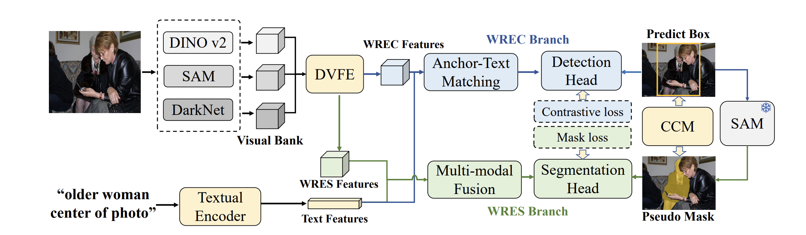

# CVPR 2025 | WeakMCN
[]()
[](https://arxiv.org/abs/2505.18686)


This repo is the official implementation of the paper "WeakMCN: Multi-task Collaborative Network for Weakly Supervised Referring Expression Comprehension and Segmentation"


## Project structure

The directory structure of the project looks like this:

```txt
├── README.md            <- The top-level README for developers using this project.
│
├── config               <- configuration 
│
├── data
│   ├── anns 
│   ├── images
│   ├── masks        
│
├── datasets              <- dataloader file
├── EfficientSAM          <- EfficientSAM directory
│
├── models  <- Source code for use in this project.
│   ├── __init__.py
│   ├── language_encoder.py             <- encoder for images' text descriptions 
│   ├── network_blocks.py               <- files included essential model blocks 
│   ├── visual_encoder.py               <- visual backbone
│   ├── weakmcn           <- most important files for WeakMCN model implementations
│   │   ├── __init__.py
│   │   ├── head.py       <- for anchor-prompt contrastive loss
│   │   ├── seg_head.py   <- for segmentation head
│   │   ├── head.py       <- for anchor-prompt contrastive loss
|   |   ├── net.py        <- main code for WeakMCN model
│   │
│   │
├── utils  <- hepler functions
├── requirements.txt     <- The requirements file for reproducing the analysis environment
│── train.py   <- script for training the model
│── test.py    <- script for testing from a model
└── LICENSE    <- Open-source license if one is chosen
```

## Installation 
Instructions on how to clone and set up your repository:

### Clone this repo :

- Clone the repository and navigate to the project directory:

```bash
git clone https://github.com/MRUIL/WeakMCN.git
cd weakmcn
```

### Create a conda virtual environment and activate it:
```bash
conda create -n weakmcn python=3.9 -y
conda activate weakmcn
```
### Install the required dependencies:
- Install Pytorch following the [offical installation instructions](https://pytorch.org/get-started/locally/) 

(We run all our experiments on pytorch 1.11.0 with CUDA 11.3)

- Install apex following the [official installation guide](https://github.com/NVIDIA/apex#quick-start) for more details.

(or use the following commands we copied from their offical repo)
```bash
git clone https://github.com/NVIDIA/apex
cd apex
git checkout origin/22.02-parallel-state 
python setup.py install --cuda_ext --cpp_ext
pip3 install -v --no-cache-dir ./
```

- Clone the EfficientSAM repository
```bash
cd EfficientSAM
mkdir weights
cd weights
wget https://github.com/yformer/EfficientSAM/raw/refs/heads/main/weights/efficient_sam_vitt.pt
wget https://github.com/yformer/EfficientSAM/raw/refs/heads/main/weights/efficient_sam_vits.pt.zip
unzip efficient_sam_vits.pt.zip
cd ../..
```

#### Compile the DCN layer:
```bash
cd utils/DCN
./make.sh
```
#### Install remaining dependencies
```bash
pip install -r requirements.txt
pip install transformers==4.41.1
wget https://github.com/explosion/spacy-models/releases/download/en_vectors_web_lg-2.1.0/en_vectors_web_lg-2.1.0.tar.gz -O en_vectors_web_lg-2.1.0.tar.gz
pip install en_vectors_web_lg-2.1.0.tar.gz
```
### Data Preparation
- Download images and Generate annotations according to [SimREC](https://github.com/luogen1996/SimREC/blob/main/DATA_PRE_README.md) 

(We also prepared the annotations inside the data/anns folder for saving your time)

- Download the pretrained weights of YoloV3 from [Google Drive](https://drive.google.com/file/d/1nxVTx8Zv52VSO-ccHVFe2ggG0HbGnw9g/view?usp=sharing) 

(We recommend to put it in the main path of WeakMCN otherwise, please modify the path in config files)

- The data directory should look like this:

```txt
├── data
│   ├── anns            
│       ├── refcoco.json            
│       ├── refcoco+.json              
│       ├── refcocog.json                   
│   ├── images 
│       ├── train2014
│           ├── COCO_train2014_000000515716.jpg              
│           ├── ...
│   ├── masks
... the remaining directories    
```
- NOTE: our YoloV3 is trained on COCO’s training images, excluding those in RefCOCO, RefCOCO+, and RefCOCOg’s validation+testing

## Training 
- If you want to train WeakMCN with SAM ViT-tiny backbone, you can run the following command:
```bash
python train.py --config ./config/refcoco_tuning.yaml
python train.py --config ./config/refcoco+_tuning.yaml
python train.py --config ./config/refcocog_tuning.yaml
```
- If you want to train WeakMCN with SAM ViT-base backbone, you can run the following command:
```bash
python train.py --config ./config/refcoco_tuning_v2.yaml
python train.py --config ./config/refcoco+_tuning_v2.yaml
python train.py --config ./config/refcocog_tuning_v2.yaml
```

## Evaluation

```bash 
python test.py --config ./config/[DATASET_NAME].yaml --eval-weights [PATH_TO_CHECKPOINT_FILE]
```

## Model Zoo

### Models trained on RefCOCO dataset
<table>
  <thead>
    <tr>
      <th rowspan="2">Method</th>
      <th colspan="3">REC</th>
      <th colspan="3">RES</th>
      <th rowspan="2">checkpoint</th>
    </tr>
    <tr>
      <th>val</th>
      <th>testA</th>
      <th>testB</th>
      <th>val</th>
      <th>testA</th>
      <th>testB</th>
    </tr>
  </thead>
  <tbody>
    <tr>
      <td>WeakMCN (SAM Vit-tiny)</td>
      <td>68.63</td>
      <td>70.18</td>
      <td>62.36</td>
      <td>58.41</td>
      <td>60.06</td>
      <td>56.08</td>
      <td><a href="https://example.com/checkpoint1">link</a></td>
    </tr>
    <tr>
      <td>WeakMCN (SAM Vit-base)</td>
      <td>69.22</td>
      <td>70.76</td>
      <td>63.43</td>
      <td>59.49</td>
      <td>61.01</td>
      <td>56.40</td>
      <td><a href="https://example.com/checkpoint2">link</a></td>
    </tr>
  </tbody>
</table>

### Models trained on RefCOCO+ dataset
<table>
  <thead>
    <tr>
      <th rowspan="2">Method</th>
      <th colspan="3">REC</th>
      <th colspan="3">RES</th>
      <th rowspan="2">checkpoint</th>
    </tr>
    <tr>
      <th>val</th>
      <th>testA</th>
      <th>testB</th>
      <th>val</th>
      <th>testA</th>
      <th>testB</th>
    </tr>
  </thead>
  <tbody>
    <tr>
      <td>WeakMCN (SAM Vit-tiny)</td>
      <td>51.14</td>
      <td>56.92</td>
      <td>42.22</td>
      <td>42.51</td>
      <td>48.91</td>
      <td>35.10</td>
      <td><a href="https://example.com/checkpoint1">link</a></td>
    </tr>
    <tr>
      <td>WeakMCN (SAM Vit-base)</td>
      <td>69.22</td>
      <td>70.76</td>
      <td>63.43</td>
      <td>59.49</td>
      <td>61.01</td>
      <td>56.40</td>
      <td><a href="https://example.com/checkpoint2">link</a></td>
    </tr>
  </tbody>
</table>


### Models trained on RefCOCO+ dataset
<table>
  <thead>
    <tr>
      <th rowspan="2">Method</th>
      <th colspan="1">REC</th>
      <th colspan="1">RES</th>
      <th rowspan="2">checkpoint</th>
    </tr>
    <tr>
      <th>val</th>
      <th>val</th>
    </tr>
  </thead>
  <tbody>
    <tr>
      <td>WeakMCN (SAM Vit-tiny)</td>
      <td>53.82</td>
      <td>45.73</td>
      <td><a href="https://example.com/checkpoint1">link</a></td>
    </tr>
    <tr>
      <td>WeakMCN (SAM Vit-base)</td>
      <td>55.00</td>
      <td>46.81</td>
      <td><a href="https://example.com/checkpoint2">link</a></td>
    </tr>
  </tbody>
</table>

## Acknowledgement

This repository is built upon [`RefCLIP`](https://github.com/kingthreestones/RefCLIP.git), [`LaConvNet`](https://github.com/luogen1996/LaConvNet.git), and [`SimREC`](https://github.com/luogen1996/SimREC.git). Thanks for those well-organized codebases.

## Citation

```bibtex
@inproceedings{cheng2025weakmcn,
  title={WeakMCN: Multi-task Collaborative Network for Weakly Supervised Referring Expression Comprehension and Segmentation},
  author={Cheng, Silin and Liu, Yang and He, Xinwei and Ourselin, Sebastien and Tan, Lei and Luo, Gen},
  booktitle={Proceedings of the Computer Vision and Pattern Recognition Conference},
  pages={9175--9185},
  year={2025}
}
```


